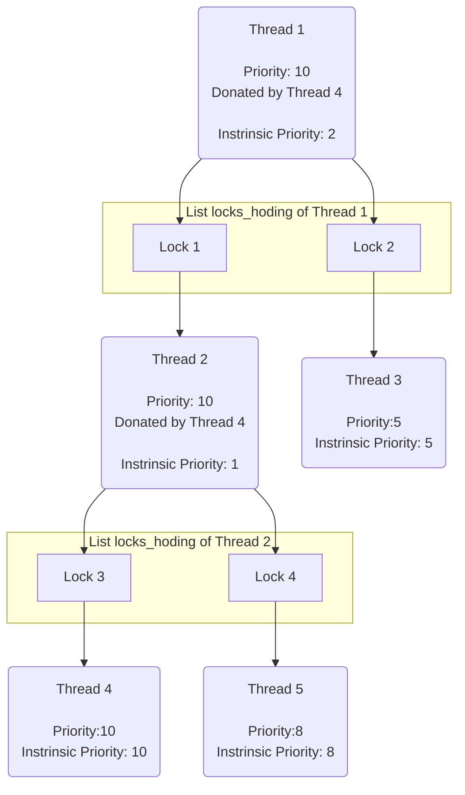
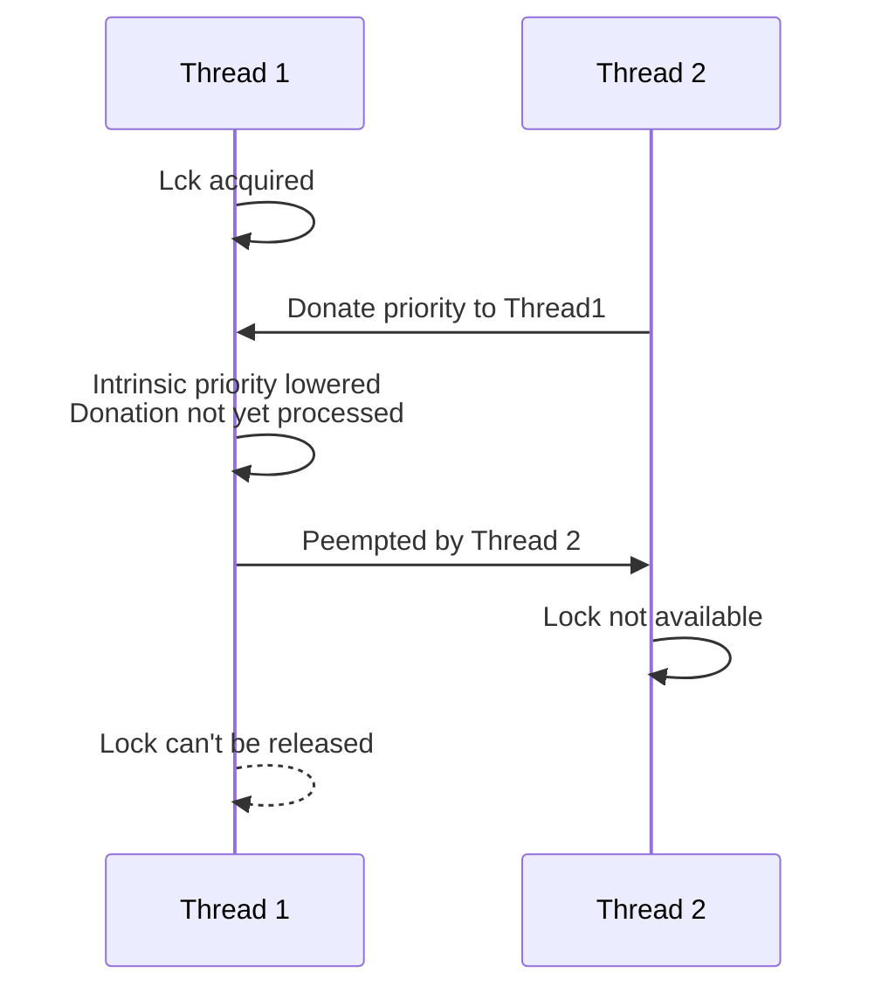

# CS 140  PROJECT 1:  THREADS DESIGN DOCUMENT

### GROUP

*Fill in the names and email addresses of your group members.*

* Chuyi Zhao <zhaochy1@shanghaitech.edu.cn>
* Bowen Xu <xubw@shanghaitech.edu.cn>

### PRELIMINARIES

*If you have any preliminary comments on your submission, notes for the TAs, or extra credit, please give them here. Please cite any offline or online sources you consulted while preparing your submission, other than the Pintos documentation, course text, lecture notes, and course staff.*

* blog for reference: https://www.cnblogs.com/laiy/p/pintos_project1_thread.html  
* p1.1: Thanks for TA's tutorial.  
* p1.3: Refer `fixed_point.h` from https://github.com/laiy/Pintos/blob/master/src/threads/fixed_point.h, (which is missed from local copy)

## ALARM CLOCK

### DATA STRUCTURES

#### A1: Copy here the declaration of each new or changed `struct` or `struct` member, global or static variable, `typedef`, or enumeration.  Identify the purpose of each in 25 words or less.

In `timer.c` : 
```c
/* decrease `ticks_to_wait` for the waiting threads */
static void
decre_ticks(struct thread *thread, void* aux)
```
In `struct thread`: 
```c
int ticks_to_wait;  /* for p1.1:remaining ticks to wait, thread `ready` when 0 */
```

### ALGORITHMS

#### A2: Briefly describe what happens in a call to `timer_sleep()`, including the effects of the timer interrupt handler.

1. Set `currentThread->ticks_to_wait` to `ticks` we want it to sleep
2. Call `thread_block()` to put it in the `waiting_list` 

#### A3: What steps are taken to minimize the amount of time spent in the timer interrupt handler?

In `timer_interrupt()` :  
1. Increase `ticks`, which means the time going on.  
2. Decrease `ticks to wait` for all **waiting** threads, which is done by calling `thread_foreach()` and `decre_ticks()`  
3. Call `thread_tick()`

### SYNCHRONIZATION

#### A4: How are race conditions avoided when multiple threads call timer_sleep() simultaneously?

I disabled the interrupts during certain operation, so that they are atom operations:
```c
enum intr_level old_level = intr_disable ();
intr_set_level (old_level);
```
The operations of setting `ticks_to_wait` to zero and `block` are enclosed by the 2 instruction above.

#### A5: How are race conditions avoided when a timer interrupt occurs during a call to timer_sleep()?

The two lines above are used in both `timer_interrupt()` and `timer_sleep()`.

### RATIONALE

#### A6: Why did you choose this design?  In what ways is it superior to another design you considered?

TA taught so in the tutorial. Sorry but I have so many docs and codes to read and I cannot think of another method.

## PRIORITY SCHEDULING

### DATA STRUCTURES

#### B1: Copy here the declaration of each new or changed `struct` or `struct` member, global or static variable, `typedef`, or enumeration.  Identify the purpose of each in 25 words or less.

In `sturct thread`
```c
int priority;                    /* Representational priority,
                                    Used in the sorting of schedule()
                                    May change because of donation. */
int intrinsic_priority;          /* Intrinsic priority of the thread
                                    Would not change because of donation */
struct list locks_holding;       /* List of locks this thread holds
                                    Who is waiting for me?*/
struct lock *blocked_by_lock;    /* The lock blocking this thread
                                    And I am waiting for whom?*/
```

In `struct lock`
```c
struct list_elem holder_list_elem;  /* register the lock 
                                       to holder list of a thread */
```

#### B2: Explain the data structure used to track priority donation. Use ASCII art to diagram a nested donation.  (Alternately, submit a .png file.)

The donation chain of priority is maintained by the list `locks_holding` stored in each thread. Threads receives donation from the `waiters` of the `locks` held by itself.



### ALGORITHMS

#### B3: How do you ensure that the highest priority thread waiting for a lock, semaphore, or condition variable wakes up first?

* Semaphore  
    All the threads wanting to `down` a semaphore will be unblocked and added to `ready_list` , then sorted by the scheduler. The highest priority thread will get its chance to `down` the semaphore. The other threads will be blocked again since the semaphore can't be downed any more.
* Lock  
    The waiting list of a `lock` is maintained by its member `semaphore`. Priority scheduling of locks is guaranteed as the way done for semaphore.
* Condvar  
    Waiting list of a `condvar` is maintained independently. The waiting threads will be sorted by their priority when a `condvar` is signaled. Only one of them will be pushed to `ready_list`,

#### B4: Describe the sequence of events when a call to lock_acquire() causes a priority donation.  How is nested donation handled?

`lock_acquire()` causes a priority donation only if the lock can't be acquired, or to say, held by another thread. Which means that the thread wanted to acquire the lock will have to **wait for** the holder of the lock. Priority of current thread will then be donated to the holder thread. In case the holder thread is waiting for, and also, blocked by another thread, nested priority donation is carried out by iterating along the `blocked_by_lock` pointer, donating the priority till the top holder.

#### B5: Describe the sequence of events when lock_release() is called on a lock that a higher-priority thread is waiting for.

The donee thread will have to recalculate its priority. In case other threads still waiting for the current thread('s other possible locks), the highest priority of all the waiters of all the locks held by the current thread is collected from all the the waiting threads (also donor threads) by iterating the `waiter` list of each lock in the `locks_holding` list.

### SYNCHRONIZATION
#### B6: Describe a potential race in thread_set_priority() and explain how your implementation avoids it.  Can you use a lock to avoid this race?



Interrupt is disabled until the intrinsic priority is set and the representational priority is recalculated.

Lock should not be used since it will trigger priority donation.

### RATIONALE

#### B7: Why did you choose this design?  In what ways is it superior to another design you considered?

I once considered using a global list to store the donation relationship, but found it redundant since the donation chain is well defined by the interleaving double-linked relationship of locks and threads.

## ADVANCED SCHEDULER

### DATA STRUCTURES

#### C1: Copy here the declaration of each new or changed `struct' or `struct' member, global or static variable, `typedef', or enumeration.  Identify the purpose of each in 25 words or less.

Functions are declared in `thread.h` and defined in `thread.c`:
```c
/* in struct `thread`: */
int nice
int64_t recent_cpu

/* globally: */
int max_pri     /* to record max priority */
int64_t load_avg
int ready_threads
#define nice_min -20
#define nice_max 20


/* p1.3: update ready_threads = all ready threads num + running threads(not idle) */
void update_ready_threads(void);
/* p1.3: update load_avg */
void update_load_avg(void);
/* p1.3: recompute `recent_cpu`  */
void update_recent_cpu(struct thread *thread, void *aux UNUSED);
/* p1.3: update recent_cpu by increasing 1 per seceond */
void current_recent_cpu_increse_1(void);
/* p1.3: recalculate the priority. */
void recalcu_priority(struct thread *thread, void *aux UNUSED);
```

### ALGORITHMS

#### C2: Suppose threads A, B, and C have nice values 0, 1, and 2.  Each has a recent_cpu value of 0.  Fill in the table below showing the scheduling decision and the priority and recent_cpu values for each thread after each given number of timer ticks:


<table>
<tr><th rowspan='2'>timer ticks</th><th colspan='3'>recent_cpu</th><th colspan='3'>priority</th><th rowspan='2'>thread to run</th></tr>
<tr><td>A</td><td>B</td><td>C</td><td>A</td><td>B</td><td>C</td>
<tr><td>0 </td><td>0 </td><td>0 </td><td>0</td><td>63</td><td>61</td><td>59<td>A</td></tr>
<tr><td>4 </td><td>4 </td><td>1 </td><td>2</td><td>62</td><td>61</td><td>59<td>A</td></tr>
<tr><td>8 </td><td>8 </td><td>1 </td><td>2</td><td>61</td><td>61</td><td>59<td>B</td></tr>
<tr><td>12</td><td>8 </td><td>5 </td><td>2</td><td>61</td><td>59</td><td>59<td>A</td></tr>
<tr><td>16</td><td>12</td><td>5 </td><td>2</td><td>60</td><td>59</td><td>59<td>B</td></tr>
<tr><td>20</td><td>12</td><td>9 </td><td>2</td><td>60</td><td>58</td><td>59<td>A</td></tr>
<tr><td>24</td><td>16</td><td>9 </td><td>2</td><td>59</td><td>58</td><td>59<td>C</td></tr>
<tr><td>28</td><td>16</td><td>9 </td><td>6</td><td>59</td><td>58</td><td>58<td>B</td></tr>
<tr><td>32</td><td>16</td><td>13</td><td>6</td><td>59</td><td>57</td><td>58<td>A</td></tr>
<tr><td>36</td><td>29</td><td>13</td><td>6</td><td>58</td><td>57</td><td>58<td>C</td></tr>
</table>

#### C3: Did any ambiguities in the scheduler specification make values in the table uncertain?  If so, what rule did you use to resolve them?  Does this match the behavior of your scheduler?

`recent_cpu` : It is counted more frequently (per tick) than priority (per 4 tick). Therefore slight miss is tolerated.  
`next_thread_to_run()`: When two threads have the same priority: run the one with least `recent_cpu`.

#### C4: How is the way you divided the cost of scheduling between code inside and outside interrupt context likely to affect performance?

According to the document

> If the timer interrupt handler takes too long, then it will take away most of a timer tick from the thread that the timer interrupt preempted. When it returns control to that thread, it therefore won't get to do much work before the next timer interrupt arrives. That thread will therefore get blamed for a lot more CPU time than it actually got a chance to use. This raises the interrupted thread's recent CPU count, thereby lowering its priority. It can cause scheduling decisions to change. It also raises the load average.

Which means, more time cost by the scheduler will lower performance.

### RATIONALE

#### C5: Briefly critique your design, pointing out advantages and disadvantages in your design choices.  If you were to have extra time to work on this part of the project, how might you choose to refine or improve your design?

Advantages:
* Few variables are added. Therefore fewer bugs and simpler.

Disadvantages:
* Time complexity could have be improved with more complex code.

Maybe the priority queues.

We use `ready_list`, only one sorted priority queues and sort it frequently. Therefore each operation like `push_back()` or `pop()` requires sorting, with $O(n)$ or $O(nlogn)$ complexity. If 64 queues are used, the time complexity could be simplified.

#### C6: The assignment explains arithmetic for fixed-point math in detail, but it leaves it open to you to implement it.  Why did you decide to implement it the way you did?  If you created an abstraction layer for fixed-point math, that is, an abstract data type and/or a set of functions or macros to manipulate fixed-point numbers, why did you do so?  If not, why not?

Macros. Simple to write and faster than functions.

## SURVEY QUESTIONS

*Answering these questions is optional, but it will help us improve the course in future quarters.  Feel free to tell us anything you want--these questions are just to spur your thoughts.  You may also choose to respond anonymously in the course evaluations at the end of the quarter.*

#### In your opinion, was this assignment, or any one of the three problems in it, too easy or too hard?  Did it take too long or too little time?

These three problems are not so hard but too nasty for beginners to get their hands on without proper hints.

#### Did you find that working on a particular part of the assignment gave you greater insight into some aspect of OS design?

This assignment involves modifying the codes for thread scheduling, which requires great insight into that aspect. I wish I had that before getting hands on this assignment. Building the insight through the procedure of this project, without extra hints, is purely exhausting.

#### Is there some particular fact or hint we should give students in future quarters to help them solve the problems?  Conversely, did you find any of our guidance to be misleading?

PLEASE make the toolchains provided conforming common development practices. 光是在vm上git clone就能有四五个坑，实在心累。

#### Do you have any suggestions for the TAs to more effectively assist students, either for future quarters or the remaining projects?

Example solution with detailed Explanation of future assignments will be helpful. Not for copy-and-paste but for insight formation.

#### Any other comments?

Autumn is coming! 记得加衣服！